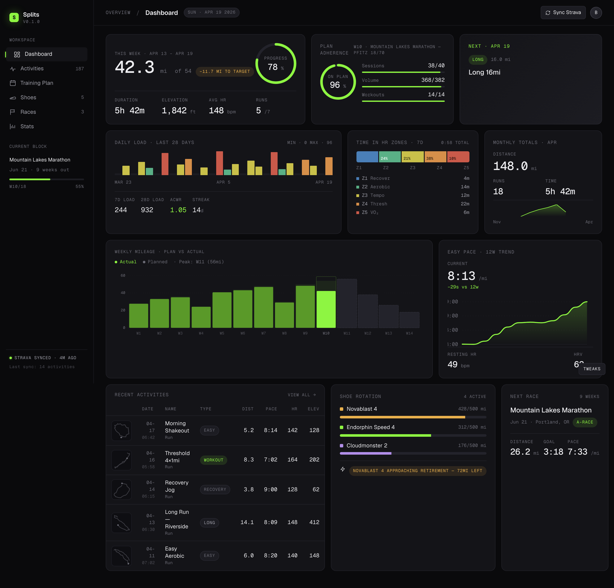
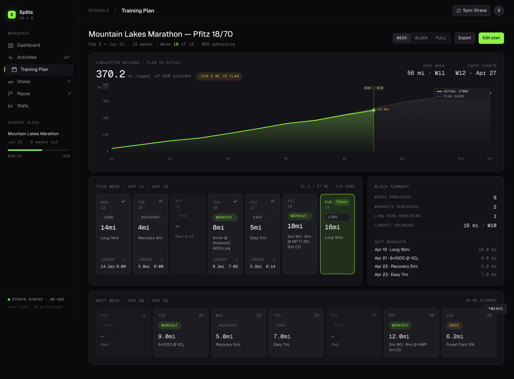
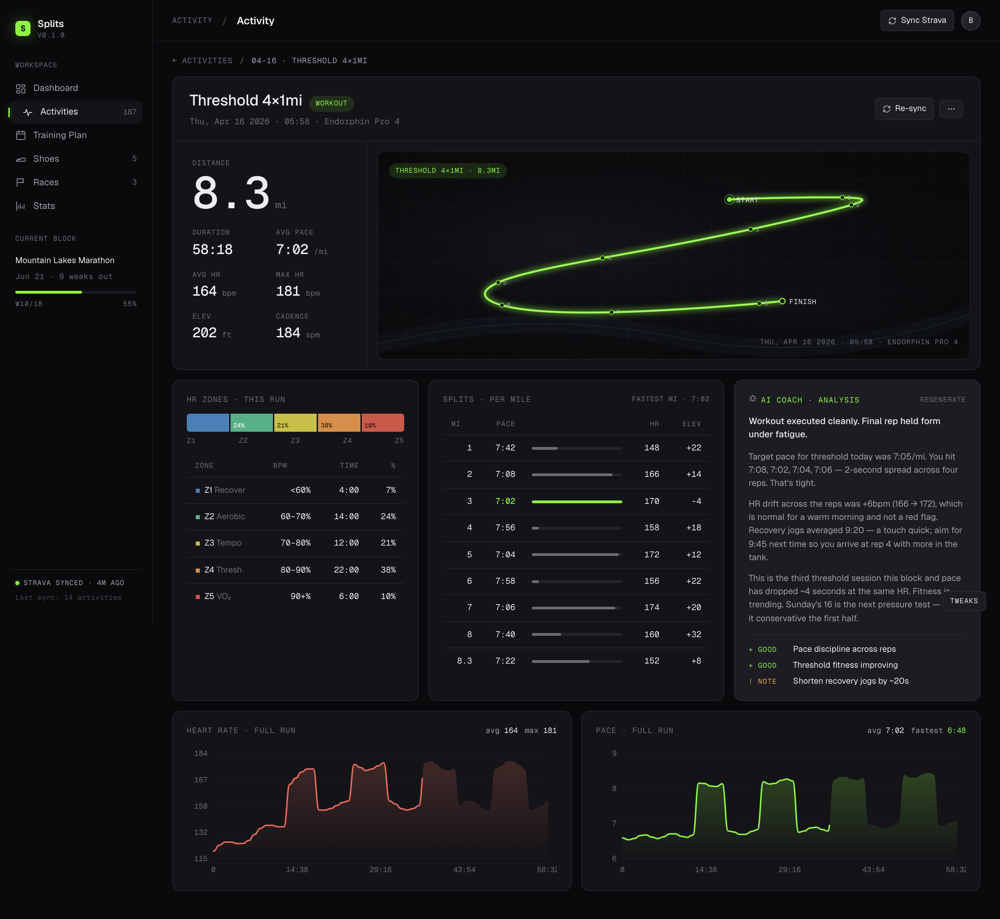
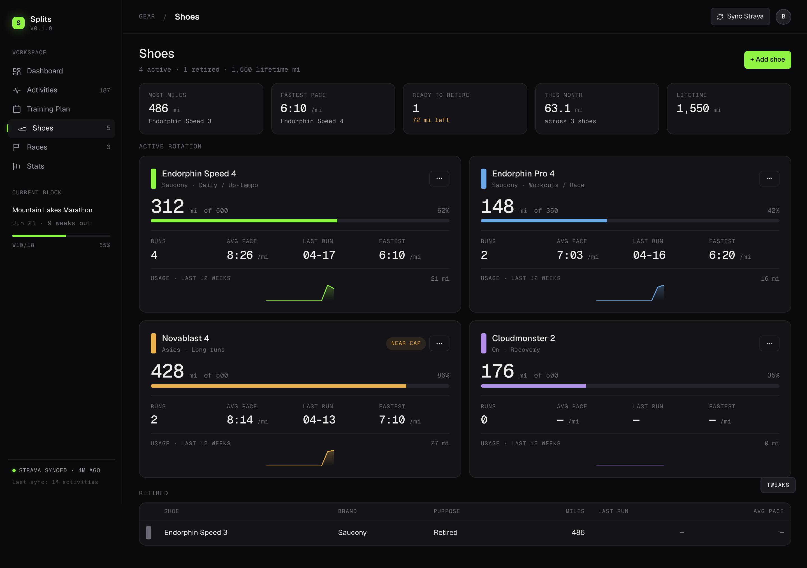
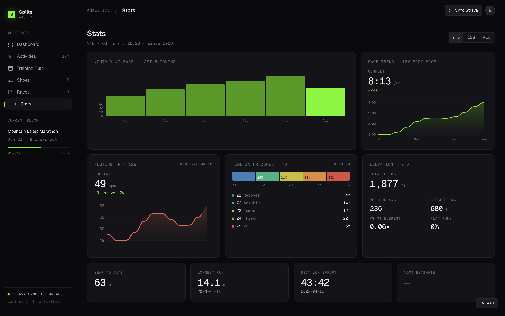

# Splits

A personal run tracker. Pulls your Strava activities into a dark-mode dashboard, tracks training plans against upcoming races, and (eventually) generates coach-style AI analyses for each run.

Single-user by design — the owner's Google email is the only one that can hold a session. Everything else locks down via Supabase RLS.

---

## Screenshots

> _Drop screenshots in `docs/screenshots/` and they'll render here._

**Dashboard**


**Training plan**


**Activity detail**


**Shoes**


**Stats**


---

## Stack

- **Next.js 14** App Router · TypeScript strict · Server components throughout
- **Supabase** (Postgres + Auth + Row-Level Security)
- **Strava** REST + webhooks
- **Anthropic** `claude-sonnet-4-6` for run analysis (planned)
- **Vercel** Hobby tier (cron included)
- Charts and maps are hand-drawn SVG — no chart library

Font: Geist + Geist Mono. Accent: electric green `#8EF542` (swappable via the floating Tweaks panel).

---

## Project layout

```
/app
  /(app)              sidebar + topbar shell
    /page.tsx         dashboard — week stats, plan adherence, next workout, load, zones, recent runs, shoes, next race
    /activities       list + detail
    /plan             burndown + week view + next-week peek
    /shoes            active rotation + retired
    /races            upcoming + completed
    /stats            6-month mileage, pace trend, zones, YTD, longest, best 10K
  /(auth)             login + connect-strava
  /api
    /auth             Google OAuth callback + email allowlist
    /strava           OAuth + webhook + disconnect
    /activities/[id]  streams (lazy fetch)
    /cron             nightly sync
/components
  /ui                 icons, pills, stats, segmented
  /charts             line, mileage bars, sparkline, ring, zone bar, load strip, burndown, miles bar
  /maps               polyline-decoded route map + thumbnail
  /shell              sidebar, topbar
/lib
  /strava             token-aware client, sync, polyline decode/normalize, types
  /supabase           browser + server + service-role clients · queries.ts (every page reads through this)
  /ai                 prompts + Anthropic runner (scaffold)
  /plan               activity ↔ planned_run matcher
  /utils              units (m↔mi), dates (TZ-safe local helpers)
/supabase/migrations
  00001_init.sql      tables + indexes
  00002_rls_policies  RLS policies (athlete-scoped)
/scripts
  seed-plan.mjs              one-time seed of training plan + race + planned_runs
  resync.mjs                 re-pull recent activities + gear from Strava (after Strava-side edits)
  backfill-polylines.mjs     one-time fix: list endpoint returns empty summary_polyline; this hits detail endpoint per activity
  register-strava-webhook.mjs run once after first prod deploy
  inspect.mjs · check-streams.mjs · test-stream-fetch.mjs   diagnostics
middleware.ts          session gate with dev bypass
vercel.json            cron schedule
```

---

## Local development

```bash
npm install
cp .env.example .env       # fill in real values, see "Setup" below
npm run dev                # http://localhost:3000
```

The app expects real env vars and a real Supabase project — there is no mock fallback anymore (the original `lib/mock/queries.ts` was the demo layer and has been replaced by `lib/supabase/queries.ts`).

---

## Setup (production)

You'll wire up four things: Supabase, Google OAuth, Strava, Anthropic. Then deploy.

### 1. Supabase project

1. Create a project at [supabase.com](https://supabase.com)
2. Settings → API → copy into `.env`:
   - `NEXT_PUBLIC_SUPABASE_URL`
   - `NEXT_PUBLIC_SUPABASE_ANON_KEY`
   - `SUPABASE_SERVICE_ROLE_KEY` _(server-only — never ship to browser)_
3. Run migrations. Either:
   - Paste `supabase/migrations/00001_init.sql` then `00002_rls_policies.sql` into the SQL editor, or
   - `supabase link --project-ref <ref> && supabase db push`

### 2. Google OAuth (Supabase auth)

1. [Google Cloud Console](https://console.cloud.google.com) → OAuth consent screen → External → add yourself as test user
2. Credentials → Create OAuth 2.0 Client ID (Web application)
3. Authorized redirect URI: `https://<your-supabase-ref>.supabase.co/auth/v1/callback`
4. In Supabase: Authentication → Providers → Google → paste Client ID + Client Secret
5. In Supabase: Authentication → URL Configuration → Site URL `http://localhost:3000`, Redirect URLs include `http://localhost:3000/**`
6. Set `ALLOWED_EMAIL` in `.env` to the Google email allowed to sign in. Anyone else is bounced.

### 3. Strava app

1. [strava.com/settings/api](https://www.strava.com/settings/api) → create an app
2. Authorization Callback Domain: bare hostname only (`localhost` for dev, `splits.yourdomain.com` for prod). No protocol, no port, no path.
3. Copy into `.env`:
   - `STRAVA_CLIENT_ID`
   - `STRAVA_CLIENT_SECRET`
4. `STRAVA_WEBHOOK_VERIFY_TOKEN=$(openssl rand -hex 16)`

### 4. Anthropic

`ANTHROPIC_API_KEY` from [console.anthropic.com](https://console.anthropic.com).

### 5. App env

```bash
NEXT_PUBLIC_APP_URL=https://splits.yourdomain.com
CRON_SECRET=$(openssl rand -hex 32)
```

### 6. Deploy

```bash
vercel deploy --prod
```

Add every env var to Vercel project settings.

### 7. Register the Strava webhook

After your first prod deploy (needs a publicly reachable URL):

```bash
node scripts/register-strava-webhook.mjs
```

Strava allows exactly one subscription per app. Pass `--delete` to tear down before re-registering.

### 8. First user flow

1. Visit your deployed URL
2. Continue with Google → sign in with `ALLOWED_EMAIL`
3. Land on `/connect-strava` → click "Connect Strava"
4. Backfill of last 2 years kicks off in background
5. **Run `node scripts/backfill-polylines.mjs`** to populate route polylines (Strava's list endpoint returns them empty — known issue, this script hits the detail endpoint per activity)
6. **(Optional) Run `node scripts/seed-plan.mjs`** after editing the constants to seed your training plan

---

## How the data flows

```
Strava ─OAuth(once)──▶  strava_tokens
       ─webhook──────▶  /api/strava/webhook ──▶  activities (upsert)
       ─REST─────────▶  backfill on connect ──▶  activities (bulk)
                        /api/activities/[id]/streams (lazy) ──▶  activity_streams

User opens any page
  └─ server component runs Promise.all([…]) of queries against Supabase
     (no client-side data layer — pages re-render fresh on every request)

Vercel Cron (nightly)
  └─ /api/cron/sync  reconciles last 14 days, re-syncs gear
```

**The frontend never calls Strava.** All Strava work happens in API routes and cron jobs on the server. Pages always read from Supabase. Page renders are fast and rate limits stay irrelevant.

---

## Architecture notes

- **`lib/supabase/queries.ts`** is the single read interface for the app. Every page imports from here. Add a new query here, not in a page file.
- **`createServerSupabase()`** is RLS-respecting (uses caller cookies). Use it from server components and route handlers when reading user-scoped data.
- **`createServiceRoleSupabase()`** bypasses RLS. Only used in webhooks, OAuth callback, cron, and one-time scripts. **Never import in a client component.**
- **Dates are TZ-sensitive.** Always use the helpers in `lib/utils/dates.ts` (`todayLocalISO`, `dayDiff`, `addDaysISO`, `mondayOfISO`). Computing today via `new Date().toISOString()` will silently roll over a day for evening visitors and break week-index math.
- **Polylines:** Strava's `/athlete/activities` list endpoint returns `summary_polyline: ""`. The detail endpoint returns `polyline` (full). The `mapActivity` mapper falls back from `summary_polyline` → `polyline` so future syncs (webhook-driven) work, but historical backfills need `scripts/backfill-polylines.mjs`.
- **Streams** (HR / pace / GPS time-series) are lazy-fetched the first time you open an activity detail. The fetch happens server-side during render, then re-queries the cache.
- **Workout type labels** (Easy / Long / Workout / Recovery / Race) come from matching the activity date to a `planned_runs` row, not from the activity name. Falls back to name keywords only when no plan match exists.

---

## Roadmap

In priority order:

1. **WHOOP integration** — pull resting HR, recovery, sleep. Will fill the "—" placeholders on Dashboard (Resting HR, VO₂) and Stats (Resting HR · 12w trend).
2. **CRUD UI** — create/edit races, plans, planned runs, gear. Right now everything is read-only or seeded via scripts.
3. **End-to-end testing** — verify every page renders correctly with edge cases (no plan, no races, manual run, indoor run).
4. **LLM run analysis** — Claude analyzes each run against its planned workout. Schema (`run_analyses`) and read-side query exist; the generation pipeline doesn't.

Beyond v1:
- Real map tiles (Mapbox or MapLibre + OSM) instead of hand-drawn SVG
- Settings page (HR zones, max HR, units, Strava disconnect)
- Mobile layout (currently desktop-only at 1440px)
- Empty/loading states (currently happy-path only)
- Tests: `lib/utils/units`, `lib/utils/dates`, `lib/strava/polyline`

---

## Gotchas

- **Strava rate limits are per-app, not per-user.** 100 requests / 15 min, 1000 / day. The detail-endpoint backfill burns ~1 request per activity, so be patient with large histories.
- **Webhook handlers return immediately.** Strava expects a 200 within ~2s, so the handler upserts and returns; no AI analysis or expensive work in the request path.
- **`claude-sonnet-4-6` not Opus.** Per-run analysis on Sonnet is plenty good; Opus would be wasteful at any meaningful volume.
- **Single-user assumptions.** The Sidebar/Topbar use `getShellSummary()` which `LIMIT 1`s on athletes. If you want multi-user, the auth chain + queries already scope by `auth.uid()`, but the shell needs work.

---

## License

TBD — currently private. Once cleaned up, intended to release under MIT.
